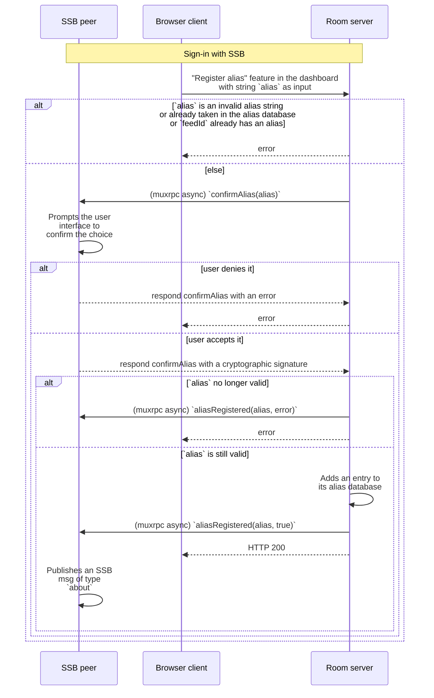

## Alias registration

An [internal user](../Stakeholders/Internal%20user.md) who does not have an alias in the current room server can choose to register an alias. Not all internal users need to have aliases, so the process described here is optional.

### Specification

1. An internal user with SSB ID `feedId` and a room server with SSB ID `roomId` are connected to each other via secret-handshake
1. The internal user [signs into](../Setup/Sign-in%20with%20SSB.md) the room's [web dashboard](../Setup/Web%20Dashboard.md)
1. The internal user uses the dashboard's "Register Alias" feature, inputting the string `alias` as candidate [alias string](Alias%20string.md)
1. The room checks whether that `alias` is valid (see spec in [Alias string](Alias%20string.md))
    1. If it is invalid, respond with an error on the web dashboard
    1. Else, proceed (below)
1. The room checks whether there already exists an entry in the [Alias database](Alias%20database.md) associated with this `feedId`
    1. If there is, respond with an error on the web dashboard
    1. Else, proceed (below)
1. The room checks whether there already exists an entry in the [Alias database](Alias%20database.md) with the *key* `alias`
    1. If there is, respond with an error on the web dashboard
    1. Else, proceed (below)
1. The room receives the internal user's `alias` via HTTPS, and calls a specific [muxrpc](https://github.com/ssb-js/muxrpc/) `async` API `confirmAlias(alias, callback)` at the internal user
1. The internal user receives the muxrpc message, and prompts the user interface to confirm this choice
    1. If it is denied, reply to the room with an error
        1. The room then responds with an error on the web dashboard
    1. Else, proceed (below)
1. The internal user responds to the room's `confirmAlias` muxrpc call with a cryptographic signature of the string `=alias-registration:${roomId}:${feedId}:${alias}` using `feedId`'s cryptographic keypair, referred to as `sig`, read more about it in the [alias database](Alias%20database.md) spec
1. The room receives the `confirmAlias` response, and checks whether the `alias` is still unclaimed in the [Alias database](Alias%20database.md) and there is no other alias associated with this `feedId`
    1. If there exists, then
        1. Calls a muxrpc `async` API `aliasRegistered(alias, error, callback)` at the internal user
        1. Respond with an error on the web dashboard
    1. Else, proceed (below)
1. The room adds an entry to its [Alias database](Alias%20database.md) for `key=alias` & `value=feedId+sig`
1. The room calls a muxrpc `async` API `aliasRegistered(alias, true, callback)` at the internal user
1. The room responds back to the web dashboard client with "success"
1. The internal user receives the `aliasRegistered` muxrpc call from the room and checks the second argument:
    1. If it is an error, then (optionally) display a user interface failure to register the alias
    1. If it is `true`, then publish an SSB msg of type `about` with a field listing all its aliases for various rooms, where this specific `alias` is included. The specific schema of the message type is an application-level concern

The above algorithm is also provided below as a UML sequence diagram:

### Security considerations

#### Malicious [internal user](../Stakeholders/Internal%20user.md)

The reason why there can be only one alias for SSB ID is to prevent a malicious internal user from exhausting many or all possible aliases in case the room accidentally allows such malicious user to become an internal user. Arguably, some room implementations could choose to relax this choice, perhaps to allow different aliases for an internal user, that covers typographic mistakes such as `aliec`, `alicce`. For the time being, it seems sensible that each internal user can receive only one alias.

### Malicious [room admin](../Stakeholders/Room%20admin.md)

The room admin could reply with errors when technically the muxrpc should have succeeded, e.g. pretending that the `alias` candidate is invalid or pretending that it's already registered.