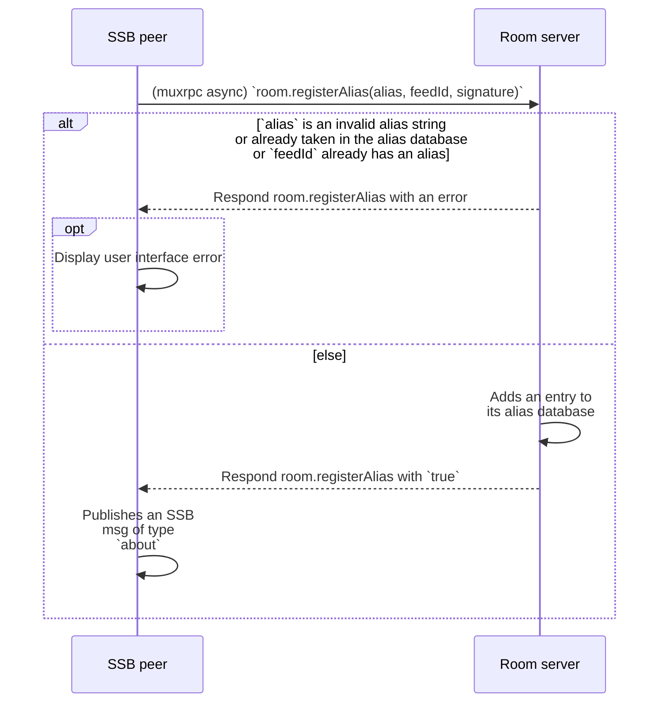

## Alias registration

An [internal user](../Stakeholders/Internal%20user.md) who does not have an alias in the current room server can choose to register an alias. Not all internal users need to have aliases, so the process described here is optional.

### Specification

1. An internal user with SSB ID `feedId` and a room server with SSB ID `roomId` are connected to each other via secret-handshake
1. The internal user chooses a `alias` as a candidate [alias string](Alias%20string.md)
1. The internal user calls a specific [muxrpc](https://github.com/ssb-js/muxrpc/) `async` API `room.registerAlias(alias, feedId, signature, callback)` where `signature` is a cryptographic signature of the string `=room-alias-registration:${roomId}:${feedId}:${alias}` using `feedId`'s cryptographic keypair, read more about it in the [alias database](Alias%20database.md) spec
1. The room, upon receiving the `room.registerAlias` muxrpc call, checks whether that `alias` is valid (see spec in [Alias string](Alias%20string.md))
    1. If it is invalid, respond `room.registerAlias` with an error
    1. Else, proceed (below)
1. The room checks whether there already exists an entry in the [Alias database](Alias%20database.md) associated with this `feedId`
    1. If there is, respond `room.registerAlias` with an error
    1. Else, proceed (below)
1. The room checks whether there already exists an entry in the [Alias database](Alias%20database.md) with the *key* `alias`
    1. If there is, respond `room.registerAlias` with an error
    1. Else, proceed (below)
1. The room adds an entry to its [Alias database](Alias%20database.md) for `key=alias` & `value=feedId+sig`
1. The room responds `room.registerAlias` with `true`, indicating success
1. The internal user receives the room's response to `room.registerAlias`
    1. If it is an error, then (optionally) display a user interface failure to register the alias
    1. If it is `true`, then publish an SSB msg of type `about` with a field listing all its aliases for various rooms, where this specific `alias` is included. The specific schema of the message type is an application-level concern

The above algorithm is also provided below as a UML sequence diagram:

### Security considerations

#### Malicious [internal user](../Stakeholders/Internal%20user.md)

The reason why there can be only one alias for SSB ID is to prevent a malicious internal user from exhausting many or all possible aliases in case the room accidentally allows such malicious user to become an internal user. Arguably, some room implementations could choose to relax this choice, perhaps to allow different aliases for an internal user, that covers typographic mistakes such as `aliec`, `alicce`. For the time being, it seems sensible that each internal user can receive only one alias.

### Malicious [room admin](../Stakeholders/Room%20admin.md)

The room admin could reply with errors when technically the muxrpc should have succeeded, e.g. pretending that the `alias` candidate is invalid or pretending that it's already registered.