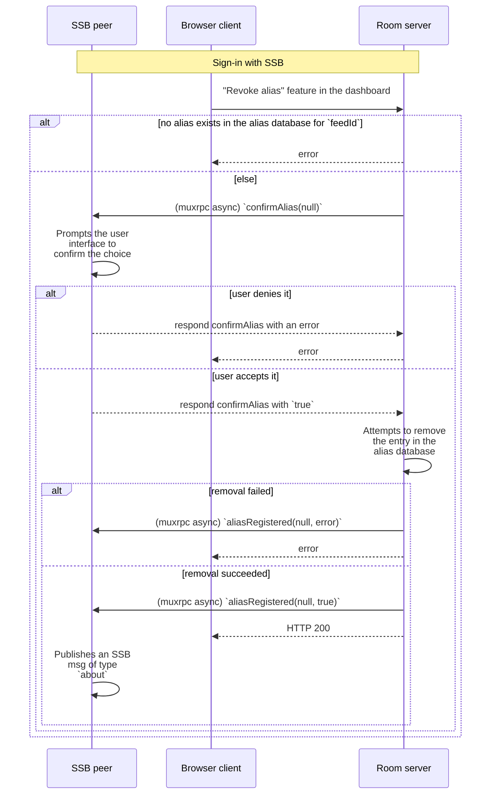

## Alias revocation

When an [internal user](../Stakeholders/Internal%20user.md) who has [registered](Registration.md) no longer wishes to have that alias associated with them anymore, they can perform *alias revocation* to remove that alias from the [alias database](Alias%20database.md).

### Specification

1. An internal user with SSB ID `feedId` and a room server with SSB ID `roomId` are connected to each other via secret-handshake. We assume the internal user has [registered](Registration.md) `alias` in the past
1. The internal user [signs into](../Setup/Sign-in%20with%20SSB.md) the room's [web dashboard](../Setup/Web%20Dashboard.md)
1. The internal user uses the dashboard's "Revoke Alias" feature
1. The room checks whether there exists an entry in the [Alias database](Alias%20database.md) associated with `feedId`
    1. If there is no entry, respond with an error on the web dashboard
    1. Else, proceed (below)
1. The room calls a specific [muxrpc](https://github.com/ssb-js/muxrpc/) `async` API `confirmAlias(null, callback)` at the internal user
1. The internal user receives the muxrpc message, and prompts the user interface to confirm the choice of revoking the alias
    1. If it is denied, reply to the room with an error
        1. The room then responds with an error on the web dashboard
    1. Else, proceed (below)
1. The internal user responds to the room's muxrpc call with a `true` boolean
1. The room receives the `confirmAlias` response, and attempts to remove the entry in the [Alias database](Alias%20database.md) associated with `feedId`
    1. If the database entry removal failed for any reason
        1. Call a muxrpc `async` API `aliasRegistered(null, error, callback)` at the internal user
        1. Respond with an error on the web dashboard
    1. Else, proceed (below)
1. The room calls a muxrpc `async` API `aliasRegistered(null, true, callback)` at the internal user
1. The room responds back to the web dashboard client with "success"
1. The internal user receives the `aliasRegistered` muxrpc call from the room and checks the second argument:
    1. If it is an error, then (optionally) display a user interface failure to revoke the alias
    1. If it is `true`, then publish an SSB msg of type `about` with a field listing all its aliases for various rooms, where this specific `alias` is no longer listed. The specific schema of the message type is an application-level concern

The above algorithm is also provided below as a UML sequence diagram:

### Security considerations

#### Malicious [room admin](../Stakeholders/Room%20admin.md)

The room admin could refuse to remove the database entry, or could delete the database entry at will (before the internal user performs revocation). In other words, the internal user does not ultimately have power over the deletion of the alias entry from the alias database, it must trust the room admin regarding deletion.