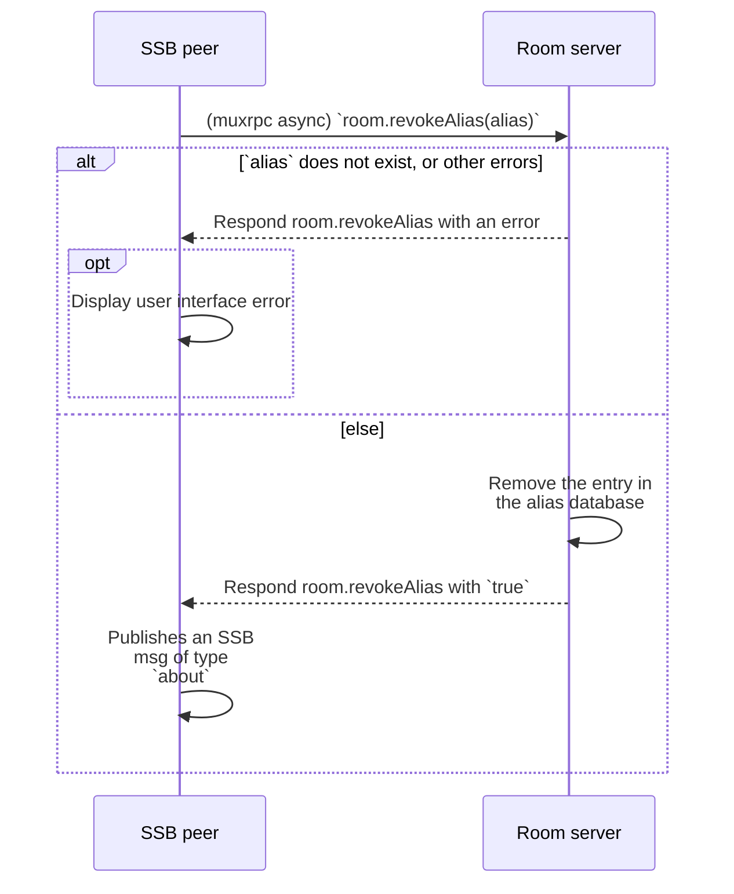

## Alias revocation

When an [internal user](../Stakeholders/Internal%20user.md) who has [registered](Registration.md) no longer wishes to have that alias associated with them anymore, they can perform *alias revocation* to remove that alias from the [alias database](Alias%20database.md).

### Specification

1. An internal user with SSB ID `feedId` and a room server with SSB ID `roomId` are connected to each other via secret-handshake
1. The internal user calls a specific [muxrpc](https://github.com/ssb-js/muxrpc/) `async` API `room.revokeAlias(alias, callback)`
1. The room, upon receiving the `room.revokeAlias` muxrpc call, checks whether there exists an entry in the [Alias database](Alias%20database.md) for `alias`
    1. If there is no entry, respond `room.revokeAlias` with an error
    1. Else, if there exists an entry for `alias` but it is not owned by `feedId`, respond `room.revokeAlias` with an error
    1. Else, proceed (below)
1. The room removes the entry from the [Alias database](Alias%20database.md) associated with `feedId`
1. The room responds `room.revokeAlias` with `true`, indicating success
1. The internal user receives the room's response to `room.revokeAlias`
    1. If it is an error, then (optionally) display a user interface failure to revoke the alias
    1. If it is `true`, then publish an SSB msg of type `about` with a field listing all its aliases for various rooms, where this specific `alias` is no longer listed. The specific schema of the message type is an application-level concern

The above algorithm is also provided below as a UML sequence diagram:

### Security considerations

#### Malicious [room admin](../Stakeholders/Room%20admin.md)

The room admin could refuse to remove the database entry, or could delete the database entry at will (before the internal user performs revocation). In other words, the internal user does not ultimately have power over the deletion of the alias entry from the alias database, it must trust the room admin regarding deletion.