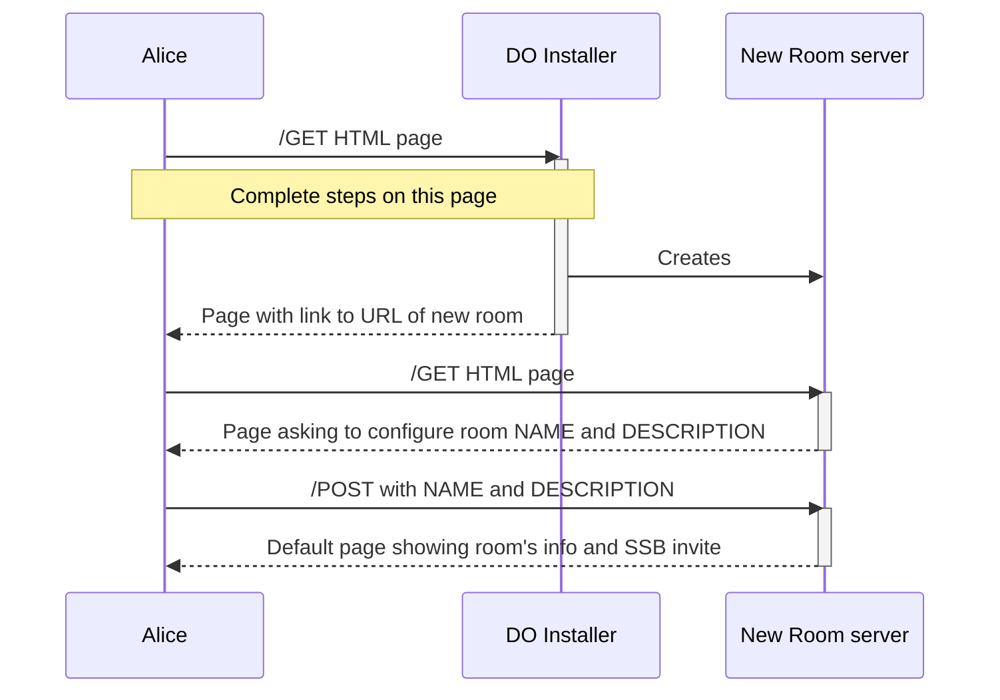

<!--
SPDX-FileCopyrightText: 2021 Andre 'Staltz' Medeiros

SPDX-License-Identifier: CC-BY-4.0
-->

Example UML diagram using Mermaid.

```mermaid
sequenceDiagram
    participant A as Alice
    participant DOI as DO Installer
    participant R as New Room server
    
    A->>DOI: /GET HTML page
    Activate DOI
    Note over A,DOI: Complete steps on this page
    DOI->>R: Creates
    DOI-->>A: Page with link to URL of new room
    Deactivate DOI
    
    A->>R: /GET HTML page
    Activate R
    R-->>A: Page asking to configure room NAME and DESCRIPTION
    Deactivate R
    
    A->>R: /POST with NAME and DESCRIPTION
    Activate R
    R-->>A: Default page showing room's info and SSB invite
    Deactivate R
```

