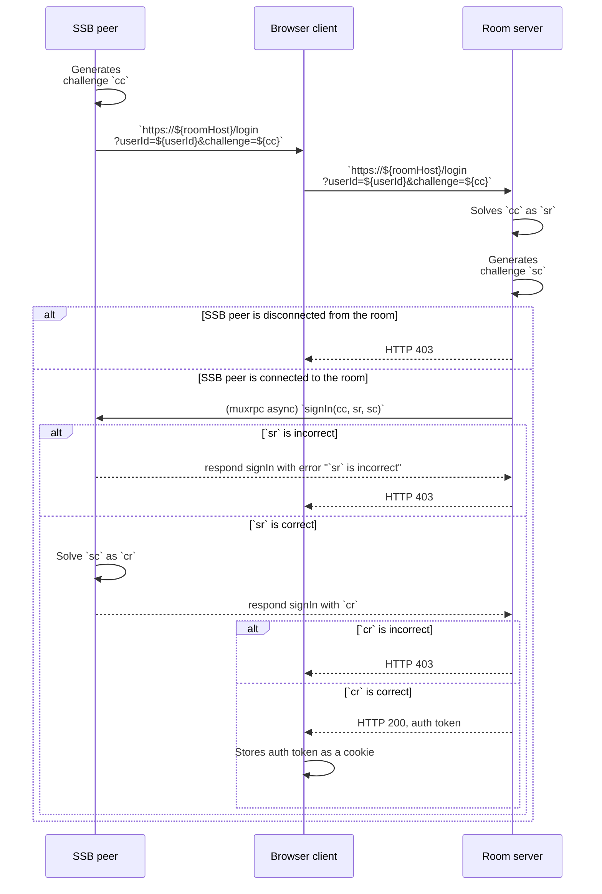

## Sign-in with SSB

To access the [WWW dashboard interface](Web%20Dashboard.md), [internal users](../Stakeholders/Internal%20user.md) (including [moderators](../Stakeholders/Moderator.md)) can use "sign-in with SSB ID".

### Specification

An [internal user](../Stakeholders/Internal%20user.md) known by its SSB ID `userId` is connected to the room via secret-handshake and muxrpc. A browser client is supposedly the same person or agent as the internal user and wishes to gain access to the web dashboard. All HTTP requests SHOULD be done with HTTPS.

The three sides (browser client, SSB peer, and room server) perform the following [challenge-response authentication](https://en.wikipedia.org/wiki/Challenge%E2%80%93response_authentication) protocol, specified as a following UML sequence diagram. We use the shorthands `cc`, `sr`, `sc`, and `cr` to mean:

- `cc`: "client's challenge"
- `sr`: "server's response"
- `sc`: "server's challenge"
- `cr`: "client's response"

The challenges, `cc` and `sc`, are [cryptographic nonces](https://en.wikipedia.org/wiki/Cryptographic_nonce) in hexadecimals. The responses, `sr` and `cr`, are the cryptographic signatures for the strings `=challenge:${cc}` and `=challenge:${sc}`, respectively, using the cryptographic keypairs that identify the server and the client, respectively.

To summarize:

- `cc` is a hexadecimal nonce string created by the client, `cr` is the cryptographic signature of the string `=challenge:${sc}` using the client's cryptographic keypair, where `${sc}` is replaced by the contents of `sc` in hexadecimal.
- `sc` is a hexadecimal nonce string created by the server, `sr` is the cryptographic signature of the string `=challenge:${cc}` using the servers's cryptographic keypair, where `${cc}` is replaced by the contents of `cc` in hexadecimal.

The UML sequence diagram for the whole protocol is shown below:

