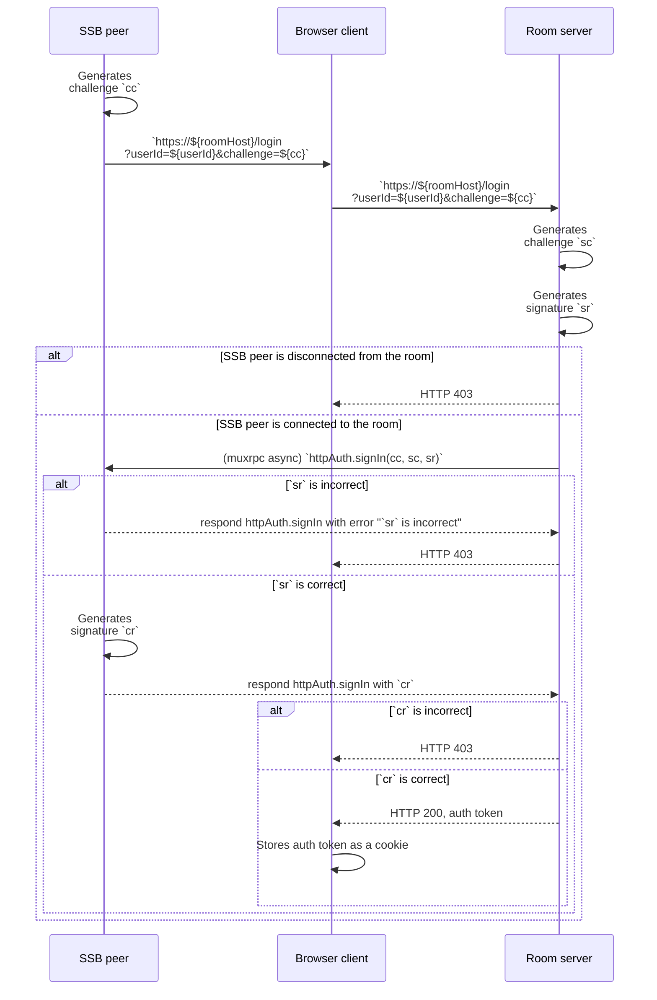
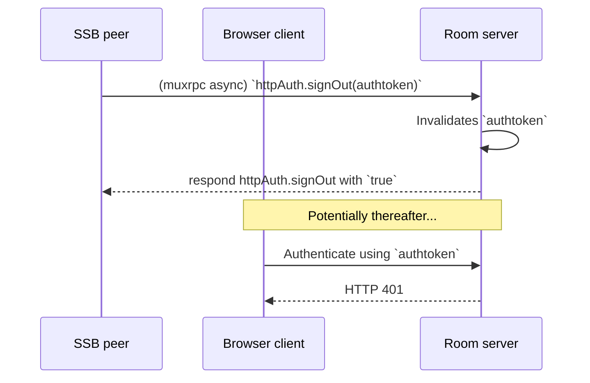
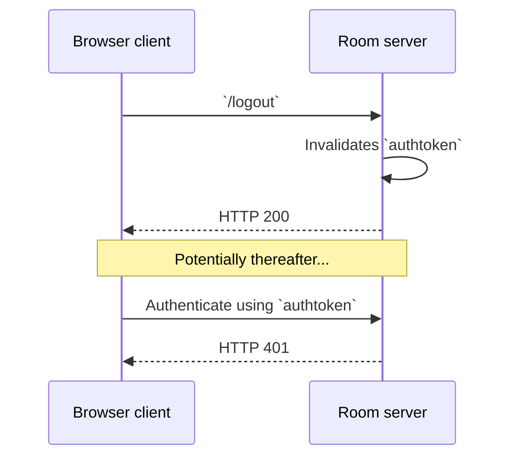

## Sign-in with SSB

To access the [WWW dashboard interface](Web%20Dashboard.md), [internal users](../Stakeholders/Internal%20user.md) (including [moderators](../Stakeholders/Moderator.md)) can use "sign-in with SSB ID".

### Specification

An [internal user](../Stakeholders/Internal%20user.md) known by its SSB ID `userId` is connected to the room via secret-handshake and muxrpc. A browser client is supposedly the same person or agent as the internal user and wishes to gain access to the web dashboard. All HTTP requests SHOULD be done with HTTPS.

The three sides (browser client, SSB peer, and room server) perform the following [challenge-response authentication](https://en.wikipedia.org/wiki/Challenge%E2%80%93response_authentication) protocol, specified as a following UML sequence diagram. We use the shorthands `cc`, `sr`, `sc`, and `cr` to mean:

- `cc`: "client's challenge"
- `sr`: "server's response"
- `sc`: "server's challenge"
- `cr`: "client's response"

The challenges, `cc` and `sc`, are 256-bit [cryptographic nonces](https://en.wikipedia.org/wiki/Cryptographic_nonce) encoded in base64. The responses, `sr` and `cr`, are cryptographic signatures using the cryptographic keypairs that identify the server and the client, respectively, described below:

- `cid` is the client's identity from their cryptographic keypair
- `sid` is the servers's identity from their cryptographic keypair
- `cc` is a 256-bit nonce created by the client, encoded in base64
- `sc` is a 256-bit nonce created by the client, encoded in base64
- `sr` is the server's cryptographic signature of the string `=http-auth-sign-in:${cid}:${sid}:${cc}:${sc}` where `${x}` means string interpolation of the value `x`
- `cr` is the client's cryptographic signature of the string `=http-auth-sign-in:${cid}:${sid}:${cc}:${sc}` where `${x}` means string interpolation of the value `x`

The UML sequence diagram for the whole protocol is shown below:

#### Sign-out

An optional (but recommended) muxrpc API `httpAuth.signOut` on the Room server to allow the SSB peer to invalidate the auth token. See UML sequence diagram:

The browser client also has the option of signing out with HTTP endpoints. This does not require a muxrpc call with the SSB peer. See UML sequence diagram:

