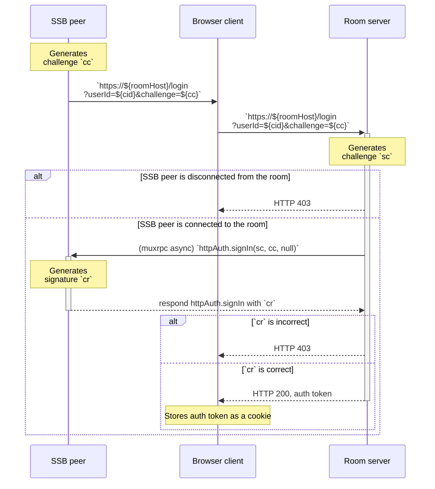
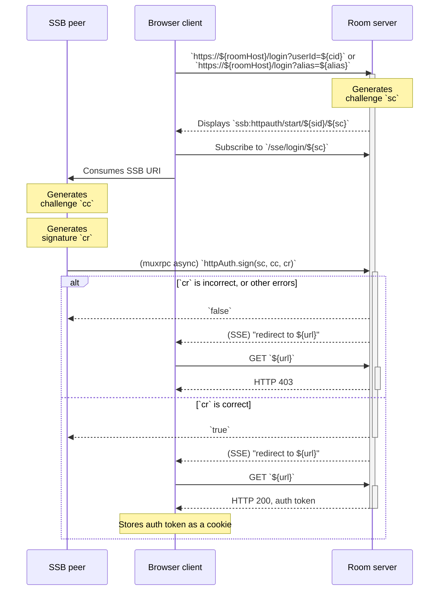
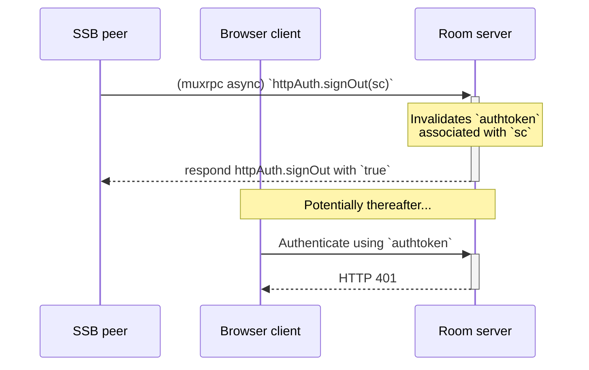
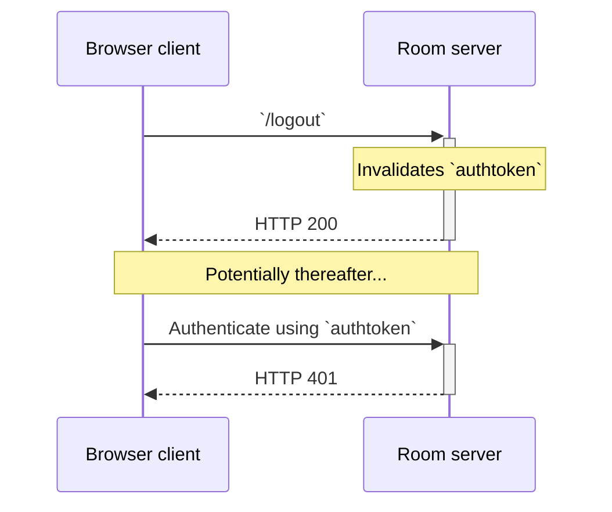

## Sign-in with SSB

To access the [WWW dashboard interface](Web%20Dashboard.md), [internal users](../Stakeholders/Internal%20user.md) (including [moderators](../Stakeholders/Moderator.md)) can use "sign-in with SSB ID".

### Specification

An [internal user](../Stakeholders/Internal%20user.md) known by its SSB ID `cid` is connected to the room via secret-handshake and muxrpc. A browser client is supposedly the same person or agent as the internal user and wishes to gain access to the web dashboard. All HTTP requests SHOULD be done with HTTPS.

The three sides (browser client, SSB peer, and room server) perform the following [challenge-response authentication](https://en.wikipedia.org/wiki/Challenge%E2%80%93response_authentication) protocol, specified as a UML sequence diagram. We use the shorthands `cc`, `sr`, `sc`, and `cr` to mean:

- `cc`: "client's challenge"
- `sr`: "server's response"
- `sc`: "server's challenge"
- `cr`: "client's response"

The challenges, `cc` and `sc`, are 256-bit [cryptographic nonces](https://en.wikipedia.org/wiki/Cryptographic_nonce) encoded in base64. The responses, `sr` and `cr`, are cryptographic signatures using the cryptographic keypairs that identify the server and the client, respectively, described below:

- `cid` is the client's identity from their cryptographic keypair
- `sid` is the servers's identity from their cryptographic keypair
- `cc` is a 256-bit nonce created by the client, encoded in base64
- `sc` is a 256-bit nonce created by the client, encoded in base64
- `sr` is the server's cryptographic signature of the string `=http-auth-sign-in:${cid}:${sid}:${cc}:${sc}` where `${x}` means string interpolation of the value `x`
- `cr` is the client's cryptographic signature of the string `=http-auth-sign-in:${cid}:${sid}:${cc}:${sc}` where `${x}` means string interpolation of the value `x`

Both sides generate the nonces, but there are use cases where one side should start first. In other words, the challenge-response protocol described here can be either **client-initiated** or **server-initiated**.

#### Client-initiated protocol

In the client-initiated variant of the challenge-response protocol, the first step is the client creating `cc` and opening a web page in the browser. Then, the server attending to that HTTP request will call `httpAuth.signIn(cc, sc, sr)` on the client SSB peer.

The UML sequence diagram for the whole client-initial protocol is shown below:

#### Server-initiated protocol

In the server-initiated variant of the challenge-response protocol, the first step is the browser requesting the server to login with a certain `cid` (or `alias`, which the server knows how to map to a `cid`). The server answers the browser, which in turn displays an SSB URI which the SSB peer knows how to open.

The primary difference between this variant and the previous one is the muxrpc async RPC `httpAuth.requestSignIn` which is used for the SSB peer to inform the room peer about the `cc`. Afterwards, the protocol is similar to the server-initiated one, with the minor addition of Server-Sent Events between the browser and the room.

The UML sequence diagram for the whole server-initial protocol is shown below:

#### Sign-out

An optional (but recommended) muxrpc API `httpAuth.signOut` on the Room server to allow the SSB peer to invalidate the auth token. See UML sequence diagram:

The browser client also has the option of signing out with HTTP endpoints. This does not require a muxrpc call with the SSB peer. See UML sequence diagram:

