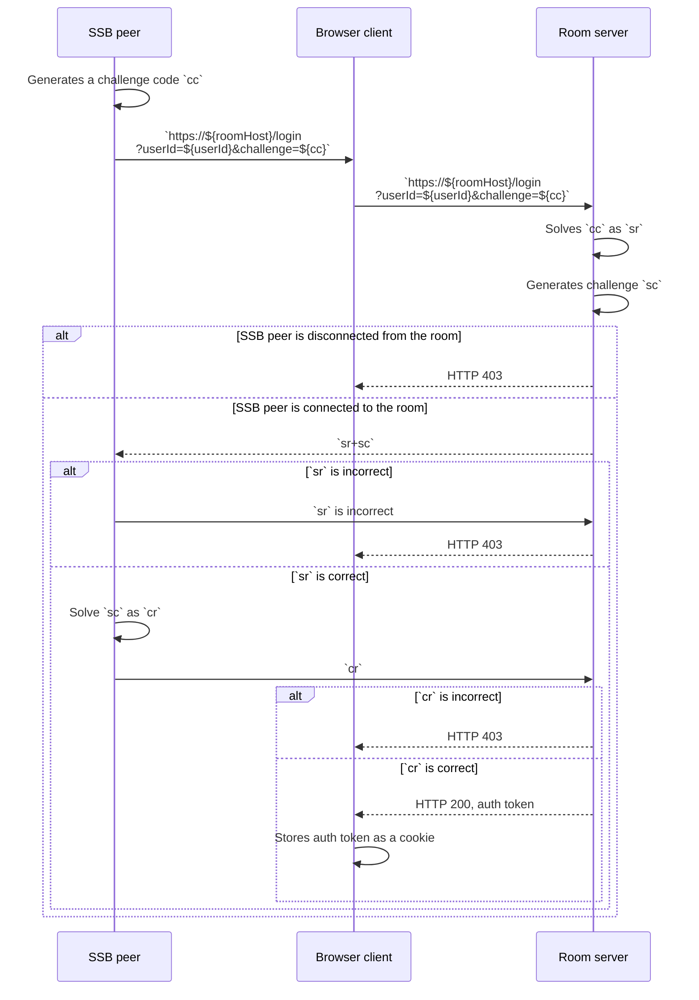

## Sign-in with SSB

To access the [WWW dashboard interface](Web%20Dashboard.md), [internal users](../Stakeholders/Internal%20user.md) (including [moderators](../Stakeholders/Moderator.md)) can use "sign-in with SSB ID".

### Specification

An [internal user](../Stakeholders/Internal%20user.md) known by its SSB ID `userId` is connected to the room via secret-handshake and muxrpc. A browser client is supposedly the same person or agent as the internal user and wishes to gain access to the web dashboard. All HTTP requests SHOULD be done with HTTPS. The three sides (browser client, SSB peer, and room server) perform the following protocol, specified as the following UML sequence diagram:

